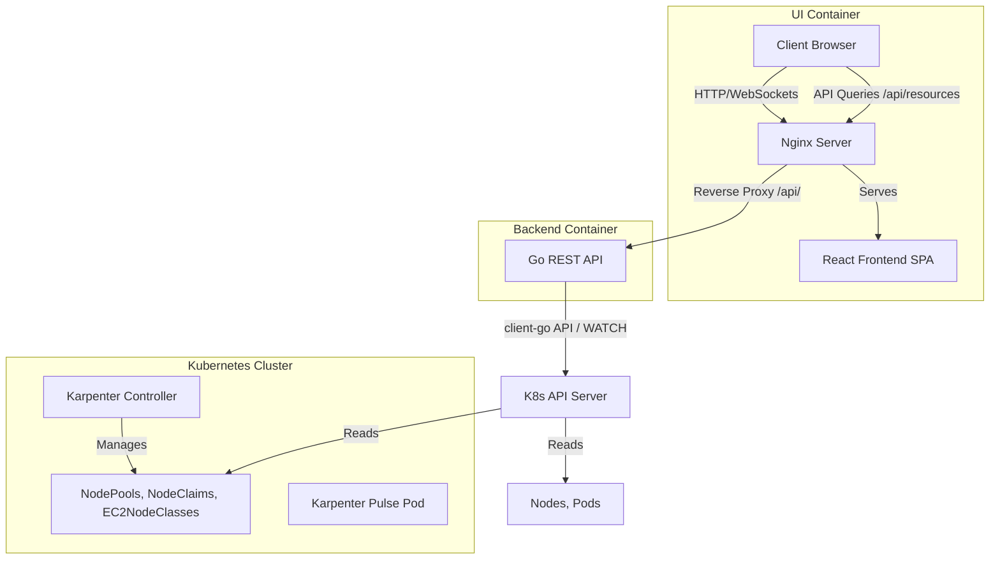

# Feature Specification: Karpenter Pulse Dashboard

**Status:** Draft / Ready for Implementation  
**Role Context:** [@Product Engineer](.agents/product_engineer.md)  
**Target Audience:** DevOps Engineers, SREs (Site Reliability Engineers), and Backend Teams  

---

## 1. Product Context & Objectives

DevOps, SRE, and Backend teams frequently struggle to monitor and debug Karpenter's rapid cluster autoscaling behaviors. Standard Kubernetes dashboards (e.g. Lens, Kubernetes Dashboard) do not display Karpenter custom resources natively or relate standard Kubernetes `Nodes` and `Pods` to the specific autoscaler `NodePools` and `NodeClaims` that spawned them.

**Karpenter Pulse** solves this by providing a unified, real-time observability control plane.

### Core Objectives:
- **Instant CRD Observability:** Enable SREs to audit NodePools, EC2NodeClasses, and NodeClaims in a single UI without context-switching to kubectl commands.
- **Resource Bottleneck Troubleshooting:** Accelerate debugging of unschedulable Pods by showing exactly why Karpenter hasn't provisioned a node for them yet (e.g. insufficient CPU/Memory, Zone mismatch).
- **Cost and Efficiency Auditing:** Enable DevOps teams to audit Spot vs On-Demand utilization ratios, active instance sizes, and estimated hourly savings.
- **Zero-Cluster Sandbox Testing:** Allow backend and frontend engineers to validate workflows locally using an interactive simulation engine without requiring active Kubernetes connection or AWS credentials.

---

## 2. System Architecture Overview



---

## 3. API Contract Specifications

All API queries accept an optional query parameter `?sandbox=true` to force operations to read from/write to the in-memory backend simulation engine rather than the active Kubernetes cluster.

### A. Resource Queries (GET)

#### `GET /api/nodes`
Returns Karpenter-managed active nodes.
- **Response Schema (`application/json`):**
  ```json
  [
    {
      "name": "ip-10-0-1-145.ec2.internal",
      "status": "Ready",
      "nodePool": "general-purpose",
      "nodeClaim": "general-purpose-qkz9m",
      "capacityType": "spot",
      "instanceType": "m6g.xlarge",
      "zone": "us-east-1a",
      "cpuAllocated": 3.2,
      "cpuCapacity": 4,
      "memAllocated": 12.5,
      "memCapacity": 16,
      "podsCount": 14,
      "age": "2h 14m",
      "costPerHour": 0.0768
    }
  ]
  ```

#### `GET /api/nodepools`
Returns NodePool configurations.
- **Response Schema (`application/json`):**
  ```json
  [
    {
      "name": "general-purpose",
      "apiVersion": "karpenter.sh/v1",
      "limits": {
        "cpu": "160",
        "memory": "640Gi"
      },
      "consolidation": "WhenEmptyOrUnderutilized",
      "consolidateAfter": "10m",
      "capacityTypes": ["spot", "on-demand"],
      "instanceCategories": ["c", "m", "r"],
      "zones": ["us-east-1a", "us-east-1b"],
      "age": "12d"
    }
  ]
  ```

#### `GET /api/nodeclasses`
Returns EC2NodeClass CRD properties.
- **Response Schema (`application/json`):**
  ```json
  [
    {
      "name": "default-aws-class",
      "apiVersion": "karpenter.k8s.aws/v1",
      "amiFamily": "AL2023",
      "subnetDiscovery": "[{\"tags\":{\"karpenter.sh/discovery\":\"my-cluster\"}}]",
      "securityGroupDiscovery": "[{\"tags\":{\"karpenter.sh/discovery\":\"my-cluster\"}}]",
      "iamRole": "KarpenterNodeRole-my-cluster",
      "diskSize": "80Gi",
      "age": "12d"
    }
  ]
  ```

#### `GET /api/nodeclaims`
Returns active NodeClaims provisioned by Karpenter.
- **Response Schema (`application/json`):**
  ```json
  [
    {
      "name": "general-purpose-qkz9m",
      "apiVersion": "karpenter.sh/v1",
      "nodePool": "general-purpose",
      "status": "Ready",
      "capacityType": "spot",
      "instanceType": "m6g.xlarge",
      "zone": "us-east-1a",
      "nodeName": "ip-10-0-1-145.ec2.internal",
      "age": "2h 14m"
    }
  ]
  ```

#### `GET /api/pods`
Returns unschedulable pending pods.
- **Response Schema (`application/json`):**
  ```json
  [
    {
      "name": "payment-processor-deployment-55d648-j2h8l",
      "namespace": "finance",
      "cpuRequest": "1500m",
      "memRequest": "2Gi",
      "nodePool": "general-purpose",
      "reason": "Unschedulable: 0/2 nodes are available: 2 Insufficient cpu.",
      "age": "45s"
    }
  ]
  ```

#### `GET /api/alerts`
Returns active Spot interruption warnings.
- **Response Schema (`application/json`):**
  ```json
  [
    {
      "id": "alert-i-0123456",
      "type": "SpotInterruption",
      "nodeName": "ip-10-0-1-145.ec2.internal",
      "instanceId": "i-0123456",
      "severity": "CRITICAL",
      "message": "Spot Interruption Warning: Instance will terminate in 2m 0s.",
      "deadline": "2026-07-14T11:50:00Z",
      "countdownSeconds": 100
    }
  ]
  ```

#### `GET /api/health`
Returns readiness/liveness.
- **Response Schema (`application/json`):**
  ```json
  {
    "status": "OK",
    "k8sConnected": true
  }
  ```

### B. Mutations & Simulations (POST)

#### `POST /api/alerts`
Injects a Spot Interruption warning.
- **Payload (`application/json`):**
  ```json
  {
    "nodeName": "ip-10-0-1-145.ec2.internal",
    "instanceId": "i-0123456"
  }
  ```

#### `POST /api/pods`
Deploys a mock pending pod (sandbox mode only).
- **Payload (`application/json`):**
  ```json
  {
    "name": "nginx-pod",
    "namespace": "default",
    "cpuRequest": "2000m",
    "memRequest": "4Gi",
    "nodePool": "general-purpose"
  }
  ```

#### `POST /api/nodes/consolidate`
Triggers eviction and node consolidation.
- **Payload (`application/json`):**
  ```json
  {
    "nodeName": "ip-10-0-1-145.ec2.internal"
  }
  ```

#### `POST /api/scale-up`
Triggers the Provisioning -> NotReady -> Ready scaling sequence (sandbox only).
- **Response status:** `200 OK`

#### `POST /api/sandbox/reset`
Resets sandbox to initial default records.
- **Response status:** `200 OK`

### C. Real-Time Streaming (WebSocket)

#### `GET /api/ws`
Upgrades connection to WebSockets.
- **Incoming events:** None (client-read only)
- **Outgoing events (JSON packets):**
  - **Type: `alerts`** (pushed whenever warnings change or tick down):
    ```json
    {
      "type": "alerts",
      "payload": [ ...spotAlertsArray... ]
    }
    ```
  - **Type: `log`** (pushed whenever events occur):
    ```json
    {
      "type": "log",
      "payload": {
        "timestamp": "2026-07-14T11:48:00Z",
        "level": "SUCCESS",
        "message": "Node became Ready (kubelet operational)"
      }
    }
    ```

---

## 4. UI/UX Page Blueprints

### A. Global Indicators
- **Manual Mode Toggle Switch (Badge):** Acts as a clickable switch in the header:
  - `Mode: Live` (Green): Streaming active metrics from the Go API.
  - `Mode: Sandbox` (Purple): Runs local mock simulations. Click to switch back to Live if cluster API is available.
- **Theme Toggle Switch (Button):** Positioned next to the Manual Mode switch:
  - Allows SREs to toggle between a default Slate/Navy Dark Mode (glassmorphic styling) and a crisp Light Mode (clean borders, high contrast).
  - Persists operator's preference to browser `localStorage` to survive page reloads.
- **Header Actions:** Quick manual trigger for sync refresh.

### B. KPI metrics
- **Active Nodes:** Count of Karpenter-managed instances with consolidation-termination indicators.
- **Resource Allocations:** Visual bars indicating aggregate CPU Cores and Memory (GiB) allocations across Karpenter nodes vs absolute capacities.
- **Active Claims:** Counts of instances that are currently `Provisioning` vs `Ready`.
- **Instance Cost / Hour Box:** Interactive pricing box showing current instance running costs. Clicking the box toggles between:
  - `SPOT (ACTUAL)`: Sum of actual costs (Spot discounts applied).
  - `ON-DEMAND`: Sum of equivalent standard On-Demand costs.
  - Displays comparative costs (e.g. On-Demand equivalent or Spot actual) and exact savings percentage (`-60%`) in the footer.

### C. Details Inspector Drawer
- When clicking on any row or card, a right-side panel slides out displaying:
  - **YAML View:** A syntax-highlighted, formatted representation of the resource spec (compiled from API fields).
  - **Metadata tags:** Color-coded label/annotation pills (e.g. `topology.kubernetes.io/zone`, `karpenter.sh/capacity-type`).

---

## 5. Simulation Sandbox Engine (Dev/Test Tool)

To allow teams to demonstrate and test Karpenter autoscaling workflows without triggering actual AWS expenses, the React UI supports client-side simulations:

1. **"Unscheduled Pod" Action:** Simulates a user deploying a workload with high CPU/GPU requests. Spawns an unscheduled pod state.
2. **"Scale Up Fleet" Action:** Simulates Karpenter's reactions:
   - Spawns a `NodeClaim` in `Provisioning` state.
   - Logs: `INFO  karpenter  Autoscaler selected spot instance type m6g.2xlarge...`
   - Spawns a new Kubernetes `Node` in `NotReady` state.
   - Transition node to `Ready`, schedules the pending pod, and updates metrics dynamically.
3. **"Consolidate Node" Action:** Simulates node deprovisioning, evicts running pods, and terminates the NodeClaim and Node records.

---

## 6. SRE/DevOps Extension Roadmap (Future Specs)

To make Karpenter Pulse a production-grade utility for SRE teams, the backend should be extended with:

### A. Prometheus Metrics Exporter (`/metrics`)
Allows integrating Karpenter metrics directly into Grafana:
- `karpenter_pulse_nodes_active{nodepool}`: Current active nodes count.
- `karpenter_pulse_estimated_cost_hourly`: Aggregated cost of provisioned nodes.
- `karpenter_pulse_pending_pods_count`: Count of unscheduled pods waiting on autoscaler.

### B. Alerting Engine (Webhooks)
Triggers webhook alerts (e.g. Slack/PagerDuty) on common Karpenter bottlenecks:
- **AWS API Throttling:** Detects if NodeClaims are stuck in `Provisioning` due to AWS rate limits.
- **Spot Insufficient Capacity:** Detects if Spot instances of a selected size are unavailable in a zone (`IceError`).
- **Resource Limit Exceeded:** Alert if a NodePool reaches its defined CPU/Memory capacity limit, preventing further autoscaling.
